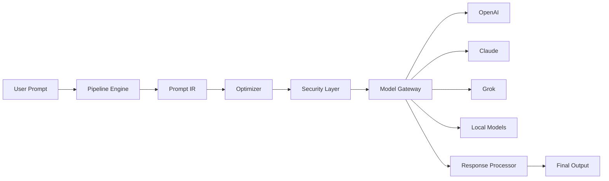

# PrivySHA

<p align="center">
<strong> The First Prompt Compiler Infrastructure for LLM Systems</strong>
</p>

<p align="center">
Transform raw prompts into optimized, structured, secure, and cost-efficient instructions, before they ever reach an LLM.
</p>

<p align="center">


</p>

<p align="center">
<strong>📚 Documentation:</strong>
<a href="https://privysha.readthedocs.io/">ReadTheDocs</a> •
<a href="https://test.pypi.org/project/privysha/0.1.1/">TestPyPI</a> •
<a href="https://github.com/AjayRajan05/privysha">GitHub</a>
</p>

---

#  What is PrivySHA?
# Overview

PrivySHA is a **compiler-inspired prompt infrastructure layer** for AI systems.

Instead of sending raw prompts directly to LLMs, PrivySHA:

```
User Prompt → PrivySHA → Optimized Prompt → Best Model → Response
```

It introduces a **structured pipeline + Prompt IR (Intermediate Representation)** to:

-  Protect privacy (PII masking, injection detection)
-  Reduce token usage (cost optimization)
-  Improve reliability (structured prompts)
-  Route to the best model automatically
-  Provide full observability (debug traces)
- 🔒 Protect privacy (PII masking, injection detection)
- ⚡ Reduce token usage (cost optimization)
- 🧠 Improve reliability (structured prompts)
- 🔁 Route to the best model automatically
- 🔍 Provide full observability (debug traces)

---

# Installation

Install PrivySHA with pip:

```bash
pip install privysha
```

For development:

```bash
git clone https://github.com/AjayRajan05/privysha.git
cd privysha
pip install -e ".[dev]"
```

---

# Quick Start

```python
from privysha import Agent

# Simple usage
agent = Agent(model="gpt-4o-mini", privacy=True)
response = agent.run("Analyze this dataset for anomalies")

# With tracing
result = agent.run("Analyze this dataset", trace=True)
print(result["optimized"])  # See optimized prompt
print(result["response"])   # See model response
```

---

# Key Features

## 🚀 Core Capabilities

- **Prompt Compilation**: Raw prompts → optimized instructions
- **Privacy Protection**: Automatic PII masking and security filtering
- **Token Optimization**: Reduce costs by 30-70% through intelligent compression
- **Smart Routing**: Automatic model selection based on task complexity
- **Full Observability**: Complete debug traces and performance metrics

## 🛠️ Advanced Features

- **Universal Adapters**: Support for OpenAI, Anthropic, Grok, HuggingFace, Ollama
- **Fallback Logic**: Automatic failover between providers
- **Security Layers**: Injection detection and threat analysis
- **Model Router**: Task-based intelligent model selection
- **Debug Tracing**: Complete pipeline visibility

---

#  Why PrivySHA?

### Traditional LLM Usage

```
User → Prompt → LLM → Response
```

Problems:

- ❌ Unstructured prompts  
- ❌ High token cost  
- ❌ No privacy guarantees  
- ❌ No control over model selection  
- ❌ No debugging visibility  

---

### With PrivySHA

```
User
↓
Sanitization + Security
↓
Prompt IR
↓
Optimization Engine
↓
Model Gateway (OpenAI / Claude / Grok / Local)
↓
Response
```

---

#  Key Features (v2)

##  Prompt IR (Compiler Core)

PrivySHA converts prompts into structured representations:

```json
{
  "intent": "analyze",
  "object": "dataset",
  "constraints": ["anomaly_detection"],
  "style": "concise",
  "privacy": { "masked": true }
}
```

This enables:

* deterministic transformations
* advanced optimization
* intelligent routing

---

##  Universal Model Gateway

Supports multiple providers out of the box:

* OpenAI (GPT models)
* Anthropic Claude
* Grok (xAI)
* HuggingFace
* Ollama (local)

```python
from privysha import Agent

agent = Agent(model="gpt-4o-mini")  # Auto-detects OpenAI
```

---

##  Multi-Model Routing

Automatically selects the best model based on:

* task type
* cost constraints
* performance

```python
from privysha import Agent

agent = Agent(
    model="gpt-4o-mini",
    fallback_providers=[
        {"provider": "anthropic", "model": "claude-3-haiku"},
        {"provider": "grok", "model": "grok-beta"}
    ]
)
```

---

##  Token & Cost Optimization

```python
from privysha import Agent

agent = Agent(model="gpt-4o-mini")

result = agent.run(prompt, trace=True)

print(result["optimization_metrics"])
```

Example:

```
Tokens before: 120
Tokens after: 38
Reduction: 68%
```

---

##  Security Layer (Beyond Guardrails)

PrivySHA actively transforms prompts:

* PII masking (email, phone, etc.)
* injection attack detection
* malicious content filtering

---

##  Full Observability (Debugger)

```python
from privysha import Agent

agent = Agent(model="gpt-4o-mini")

result = agent.run(prompt, trace=True)

agent.print_debug_trace()
```

Output:

```
RAW → SANITIZED → IR → OPTIMIZED → COMPILED → RESPONSE
```

---

#  Quick Start

```bash
pip install privysha
```

```python
from privysha import Agent

agent = Agent(
    model="gpt-4o-mini",
    privacy=True
)

response = agent.run(
    "Hey bro can you analyze this dataset for anomalies?"
)

print(response)
```

---

#  Environment Setup

```bash
export OPENAI_API_KEY=your_key
export ANTHROPIC_API_KEY=your_key
export GROK_API_KEY=your_key
```

---

#  Example

```python
# Advanced usage with fallbacks
agent = Agent(
    model="gpt-4o-mini",
    fallback_providers=[
        {"provider": "anthropic", "model": "claude-3-haiku"},
        {"provider": "grok", "model": "grok-beta"}
    ]
)

result = agent.run(
    "Analyze dataset with john@email.com",
    trace=True
)

print(result["response"])
print(result["security_result"])
print(result["optimization_metrics"])
```

---

#  Architecture



---

#  Core Components

* **Prompt IR** → structured prompt representation
* **Optimizer Engine** → token + cost reduction
* **Security Layer** → PII + injection protection
* **Model Gateway** → multi-provider abstraction
* **Router** → intelligent model selection
* **Debugger** → full pipeline tracing

---

#  Comparison

| Feature                   | PrivySHA | LangChain | Guardrails |
| ------------------------- | -------- | --------- | ---------- |
| Prompt Compiler           | ✅        | ❌         | ❌          |
| Prompt IR                 | ✅        | ❌         | ❌          |
| Cost Optimization         | ✅        | ❌         | ❌          |
| Multi-model routing       | ✅        | ⚠️        | ❌          |
| Security + Transformation | ✅        | ⚠️        | ✅          |
| Observability             | ✅        | ⚠️        | ⚠️         |

---

#  Philosophy

PrivySHA treats prompts as:

> **Programs, not strings**

This enables:

* reproducibility
* optimization
* composability
* debugging

---

#  Project Structure

```
privysha/
├── agent/
├── pipeline/
├── optimizer/
├── security/
├── gateway/
├── utils/
├── cli/
```

---

#  Documentation

**Complete documentation is available at:**

## 🔗 Links
- ** Full Documentation**: [privysha.readthedocs.io](https://privysha.readthedocs.io/)
- ** TestPyPI Package**: [test.pypi.org/project/privysha](https://test.pypi.org/project/privysha/0.1.1/)
- ** GitHub Repository**: [github.com/AjayRajan05/privysha](https://github.com/AjayRajan05/privysha)

##  Documentation Sections
- **Getting Started** - Installation and basic usage
- **API Reference** - Complete function and class documentation
- **Architecture Guide** - Understanding the pipeline and components
- **Advanced Usage** - Custom adapters, routing, and optimization
- **Examples** - Real-world use cases and code samples
- **Troubleshooting** - Common issues and solutions

##  Quick Links
- [Installation Guide](https://privysha.readthedocs.io/en/latest/installation.html)
- [Quick Start Tutorial](https://privysha.readthedocs.io/en/latest/quickstart.html)
- [API Documentation](https://privysha.readthedocs.io/en/latest/api/)
- [Examples Gallery](https://privysha.readthedocs.io/en/latest/examples/)

---


#  Contributing

```bash
git clone https://github.com/AjayRajan05/privysha
pip install -e .
pytest
```

---

#  License

Apache 2.0 License

---

#  Support

If you find this useful:

*  Star the repo
*  Open issues
*  Suggest features

---

#  Final Note

PrivySHA is not just another AI tool.

It is an attempt to define:

> **The Compiler Layer for AI Systems**
