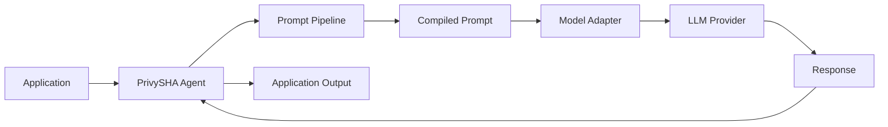
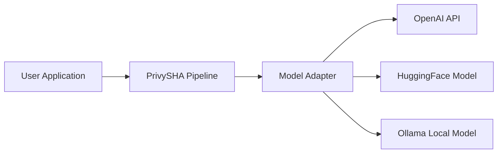
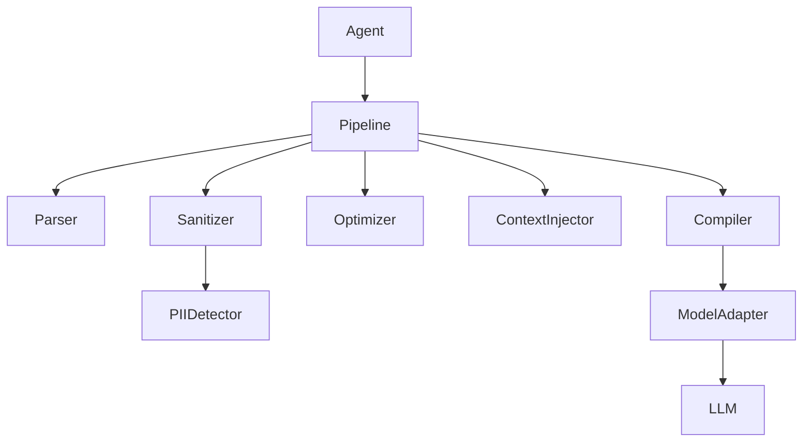
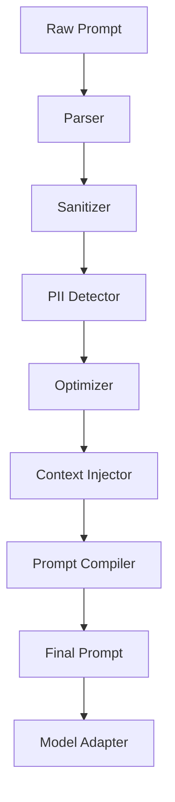
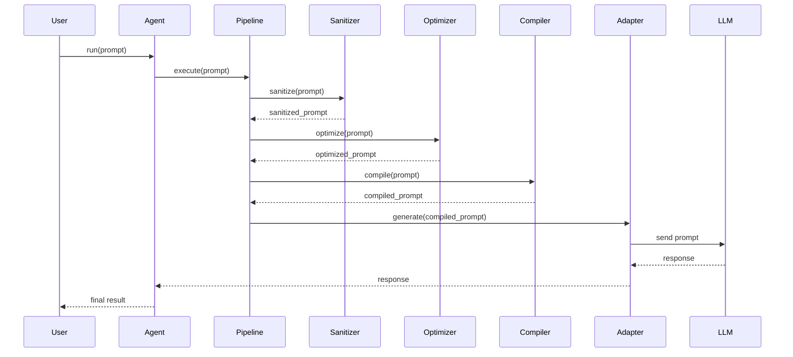
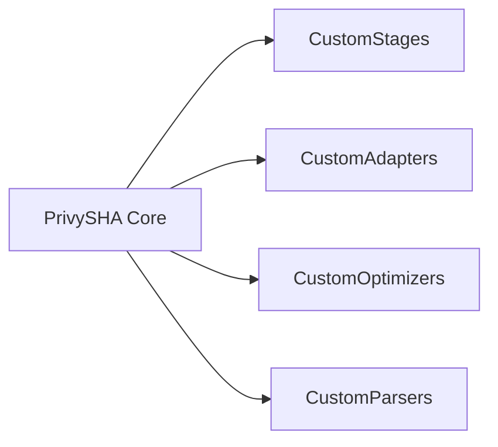

# PrivySHA Architecture

This document describes the internal architecture of **PrivySHA**, a privacy-first prompt optimization and compilation framework for AI systems.

The purpose of this document is to help developers understand:

- How the PrivySHA pipeline works
- How prompts move through the system
- The responsibilities of each module
- How developers can extend the framework

PrivySHA treats prompts as **structured programs** rather than raw text and processes them through a transformation pipeline similar to a compiler.

---

## Table of Contents

1. [Architectural Overview](#1-architectural-overview)
2. [System Context](#2-system-context)
3. [Internal Architecture](#3-internal-architecture)
4. [Prompt Processing Pipeline](#4-prompt-processing-pipeline)
5. [Pipeline Execution Sequence](#5-pipeline-execution-sequence)
6. [Component Responsibilities](#6-component-responsibilities)
7. [Developer Entry Points](#7-developer-entry-points)
8. [Directory Structure](#8-directory-structure)
9. [Extension Architecture](#9-extension-architecture)
10. [Design Principles](#10-design-principles)
11. [Future Architecture Roadmap](#11-future-architecture-roadmap)
12. [Summary](#12-summary)

---

## 1. Architectural Overview

PrivySHA acts as a **middleware layer** between an application and a language model.

It performs privacy protection, prompt optimization, and compilation before the prompt is sent to the LLM.



> PrivySHA does not implement its own language model. Instead, it prepares and optimizes prompts before sending them to external LLM providers.

---

## 2. System Context

PrivySHA integrates with applications and external model providers.



This architecture ensures that PrivySHA remains **model-agnostic**.

---

## 3. Internal Architecture

The internal system is divided into modular components.



Each component performs a well-defined transformation on the prompt.

---

## 4. Prompt Processing Pipeline

Prompts pass through a structured transformation pipeline.



Each stage transforms the prompt before passing it to the next stage.

---

## 5. Pipeline Execution Sequence

The following sequence diagram illustrates how a prompt is processed during runtime.



This design allows traceable prompt transformations and step-level debugging.

---

## 6. Component Responsibilities

### Agent

The `Agent` is the main entry point for developers using the library.

**Responsibilities:**
- Execute the pipeline
- Manage configuration
- Invoke model adapters
- Return model responses

```python
from privysha import Agent

agent = Agent(model="llama3")

response = agent.run(
    "Hey bro can you analyze this dataset for anomalies?"
)

print(response)
```

---

### Pipeline Controller

The pipeline orchestrates prompt processing stages.

**Responsibilities:**
- Enforce stage ordering
- Pass intermediate outputs between stages
- Manage debugging traces

**Pipeline stages:**

| Order | Stage            |
|-------|------------------|
| 1     | Parser           |
| 2     | Sanitizer        |
| 3     | Optimizer        |
| 4     | Context Injector |
| 5     | Compiler         |

---

### Parser

Converts natural language prompts into a structured representation (AST).

**Input:**
```
Analyze this dataset for anomalies
```

**AST representation:**
```
intent: analyze
object: dataset
task: anomaly_detection
```

---

### Sanitizer

Removes conversational noise such as greetings, filler words, and unnecessary phrasing.

**Example transformation:**

```
Hey bro can you analyze this dataset
```
↓
```
analyze dataset
```

---

### PII Detector

Detects and masks sensitive information before it reaches the model.

**Detected types include:**
- Email addresses
- Phone numbers
- Personal identifiers

**Example:**

```
john@email.com
```
↓
```
<EMAIL_HASH>
```

This ensures **privacy-first prompt handling**.

---

### Optimizer

Reduces prompt length and token usage.

**Example:**

```
Analyze this dataset for anomalies
```
↓
```
@analyze(dataset)
```

---

### Context Injector

Adds system-level instructions to guide the model's behavior.

**Example injection:**

```
SYSTEM:
You are a data scientist specializing in anomaly detection.
```

---

### Prompt Compiler

Converts the structured prompt representation into a final model-ready prompt.

**Example output:**

```
SYSTEM:
You are a data scientist

TASK:
Analyze dataset
```

---

### Model Adapter Layer

Model adapters provide a unified interface for different LLM providers.

**Supported adapters:**

| Adapter              | Provider          |
|----------------------|-------------------|
| `OpenAIAdapter`      | OpenAI API        |
| `OllamaAdapter`      | Ollama (local)    |
| `HuggingFaceAdapter` | HuggingFace Hub   |

**Unified interface:**

```python
adapter.generate(prompt)
```

This abstraction allows PrivySHA to remain **model-agnostic**.

---

## 7. Developer Entry Points

### 1. Agent Interface

Primary user-facing interface.

**File:** `privysha/agent.py`

```python
agent = Agent()
agent.run(prompt)
```

---

### 2. Pipeline Engine

Developers can run the pipeline directly for lower-level control.

**File:** `privysha/pipeline.py`

```python
pipeline = Pipeline()
result = pipeline.process(prompt)
```

---

### 3. Custom Pipeline Stages

Developers can implement new pipeline stages by following the stage interface.

```python
class CustomStage:
    def run(self, prompt):
        return transform(prompt)
```

This enables domain-specific prompt processing without modifying the core.

---

### 4. Custom Model Adapters

New LLM providers can be integrated by implementing a custom adapter.

```python
class CustomAdapter:
    def generate(self, prompt):
        return my_model(prompt)
```

---

## 8. Directory Structure

```
privysha/
│
├── agent.py
├── pipeline.py
│
├── parser/
│   └── prompt_ast.py
│
├── stages/
│   ├── sanitizer.py
│   ├── optimizer.py
│   ├── compiler.py
│   └── context.py
│
├── adapters/
│   ├── openai_adapter.py
│   ├── ollama_adapter.py
│   └── hf_adapter.py
│
└── utils/
    └── pii_detector.py
```

Each module corresponds to a distinct stage in the prompt lifecycle.

---

## 9. Extension Architecture

PrivySHA is designed for extensibility. Developers can plug into the core without modifying it.



All extension points follow the same interface contracts as the built-in components.

---

## 10. Design Principles

| Principle            | Description                                                         |
|----------------------|---------------------------------------------------------------------|
| **Modularity**       | Each stage is independent and loosely coupled                       |
| **Composability**    | Pipeline stages can be replaced or reordered                        |
| **Observability**    | Developers can inspect each prompt transformation step              |
| **Privacy by Design**| Sensitive data is detected and masked early in the pipeline         |
| **Model Agnosticism**| The system supports multiple LLM providers through a unified interface |

---

## 11. Future Architecture Roadmap

Planned improvements to the PrivySHA architecture:

- [ ] Advanced prompt AST analysis
- [ ] Prompt caching layer
- [ ] Cost-aware prompt optimization
- [ ] Multi-model routing
- [ ] Prompt benchmarking tools

---

## 12. Summary

PrivySHA introduces a **structured approach to prompt engineering**.

Instead of writing raw prompts, developers use a prompt compilation pipeline that provides:

- **Reproducible prompts** — consistent outputs across runs
- **Improved privacy** — PII masked before reaching the model
- **Reduced token costs** — optimized prompt length
- **Easier debugging** — traceable per-stage transformations

PrivySHA aims to transform prompt engineering from an ad-hoc practice into a **systematic engineering discipline**.
